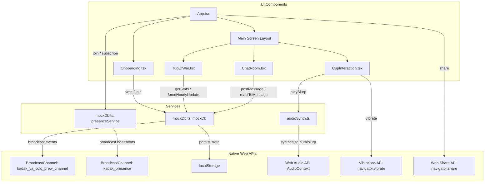

# Architecture Specification — Kadak ya Cold Brew

This document details the high-level architecture, component hierarchy, service layer, and data flow of the **Kadak ya Cold Brew** web application.

---

## 1. High-Level Architecture Overview

The application is built as a single-page React app using TypeScript, styled with TailwindCSS, and optimized for zero backend infrastructure during development/sandboxing. It relies heavily on modern browser APIs to deliver real-time features.

### Architecture Diagram



---

## 2. Key Architectural Decisions

### 2.1 Multi-Tab Peer-to-Peer Synchronization (BroadcastChannel)
Instead of requiring an immediate backend deployment (e.g., Firebase), the sandbox architecture utilizes the browser's native `BroadcastChannel` API.
*   **Presence Tracking**: The `presenceService` manages active sessions by sending out automated heartbeats (`heartbeat` & `ping`) every 3 seconds. If a tab closes, it emits a `leave` signal. Stale tabs are pruned automatically if no heartbeat is received for over 8 seconds.
*   **Message & Stats Propagation**: When a message or emoji reaction is posted, `mockDb` updates local storage and broadcasts a payload to all open tabs, forcing a state refresh in listening React components.

### 2.2 Procedural Audio Synthesis (Web Audio API)
To keep the bundle lightweight and eliminate latency/asset hosting problems:
*   **Ambient Hum**: Uses a brown noise algorithm (generated via a mathematical formula inside an audio buffer) coupled with a low-pass filter modulated by a Low-Frequency Oscillator (LFO) at `1.8Hz` to simulate a bubbling kettle and café background.
*   **Sip Gulp**: Generates a bandpass-filtered noise burst with an exponential volume ramp, combined with a low-frequency triangle wave sweep (sweeping from `140Hz` to `70Hz`) to mimic the physical slurp and gulp sound. Pitch is randomized by ±20Hz to keep successive gulps from sounding repetitive.

### 2.3 Liquid Level Vector Masking
The fluid level animation uses standard SVGs configured with `<clipPath>` definitions:
*   The boundary of the cup represents the clipping mask.
*   Inside the mask, a rectangle's vertical position (`y`) is adjusted dynamically (from 0 to 100%) to create the illusion of a draining or refilling fluid.
*   When a gulp occurs, a quick keyframe pulse alters the horizontal/vertical radii (`rx`, `ry`) of the liquid's surface ellipse to produce a brief splash ripple.

---

## 3. Component Hierarchy & State Flow

```
App.tsx (Holds current user state: side, username, sessionId)
 ├── Onboarding.tsx (User Choice Entry Screen)
 └── Main Layout (Grid Columns)
      ├── CupInteraction.tsx (Drains on mouse/touch down, plays slurp sounds, triggers haptics)
      ├── TugOfWar.tsx (Tracks counts, displays countdown and margin commentary)
      └── ChatRoom.tsx (Shared rolling buffer, emoji reaction triggers)
```

### State Storage Details
- **User Session**: `{side: "chai" | "coffee", username: string, sessionId: uuid}` is initialized upon onboarding, saved inside React state, and registered with `presenceService`.
- **Database Snapshots**: Retained in `localStorage` under `kadak_stats_v1` and `kadak_chat_v1`.
